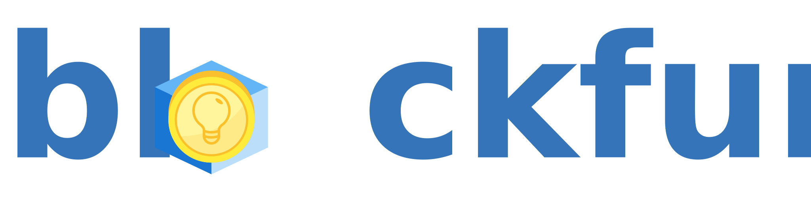

<p align="center" width="200px">
  
</p>

Blockfund is a small blockchain application that allows users to create projects they want to get funded. The application is based on the Ethereum Blockchain App Plattform. Smart Contracts manage all funds and allow users to securly support their favorite projects directly from their Ethereum wallet.

## How can I run it locally on my machine?

For testing out the application you need the following tools:

A Browser:

- Chrome and the Plugin MetaMask
- Alternative Mist

A Blockchain:

- a local running Ethereum Node
  - https://www.ethereum.org/cli
  - setting up a private blockchain is a lot of work and not that easy
- Alternative: Virtual Blockchain Ganache
  - I will use this tool for all further explainations
  - http://truffleframework.com/ganache/
  - recommended for simple try out
  - no configuration needed, just start the application

Other stuff:

- node & npm
  - see https://nodejs.org/en/ for installation instructions
- Truffle
  - see http://truffleframework.com/ for installation instructions
- Angular CLI
  - see https://cli.angular.io/ for installation instructions
- VS Code (not a must have, you can use any editor you want)
  - universal code editor
  - https://code.visualstudio.com/
  - recommended plugins:
    - Solidity by Juan Blanco
    - npm by egamma

If you have installed all tools and framworks you can run the app locally by following these instructions:

1. Open a terminal/cmd window in the project location `./application`
  - run `$ npm install` and install all dependencies for the webapp
  - run `$ truffle compile` and create contract artifacts for deploying the smart contract, you can find those artifacts under `./application/build/contracts`
2. Open Ganache and check the url for the RPC Server and the Network ID in the upper bar of the application. You will need this for configuring MetaMask and Truffle. Lets say your RPC Server URL is `http://127.0.0.1:7545` and your Network ID is `5783`
  - Connect Truffle to your local Ganache Node
    - Open `./application/truffle.js` and edit the exported network to look like the **truffle.js configuration**.
    - The gas limit (`gas`) can be set to the value of the MainNet of Ethereum (see https://ethstats.net/ for checking the current gas limit and gas price)
  - Connect MetaMask to your local Ganache Node
    - Go to Ganache and press on the key icon of the account you want to import, then select the private key and copy it
    - Choose the network chooser on the top and choose **Custom RPC**, put in your network url
    - Open the account chooser menu and select **Import Account**
    - Select **Private Key** as **Select Type**
    - Paste your private key from your clipboard
    - If everything worked out you should see your account listed in the menu with the same amount it has in Ganache
3. Deploy your application
  - Go back to your terimal/cmd window and run `$ truffle migrate`
  - If everything worked out, your contract should be deployed correctly
4. Start the Angular webapp
  - Run `$ npm start`
  - Go to Chrome with your configured MetaMask and navigate to `http://localhost:4200/catalog`
  - If you see an empty catalog and no errors in the console, everything should have worked out fine

#### truffle.js configuration:
``` JS
module.exports = {
    networks: {
         development: {
              host: "127.0.0.1",
              port: 7545,
              network_id: "5783",
              gas: 6721975
            }
       }
};
```

## How do I use the app?

If you followed all the steps above, working with the app is really simple. To create a new project, you press on the floating action button in the bottom right corner. On this page you can configure your personal project. The adress should be injected automaticly with MetaMask. If not, check if MetaMask is unlocked with the password you have chosen on the first startup. If you switch accounts in MetaMask, you have to reload the page to get the updated account adress.

When you press the button to create the project, MetaMask will ask you in a popup to confirm your transaction that will deploy a new instance of the project contract, that represents your personal project. All Funds that are sent to support the project will be stored in this contract instances.

After you created the project, you must wait for Ganache to mine it. This should only take a few seconds. After this you can reload the page and if everything worked out, you should see your newly created project. Now you can switch the account to MetaMask and fund the project on

## Future Plans

- Add reaction for event emitting -> autorefresh page when transactions are mined
- Look into configuring a docker container that provides truffle, node, npm angular and local geth node with private blockchain so configuration (https://github.com/ethereum/go-ethereum/wiki/Running-in-Docker)
